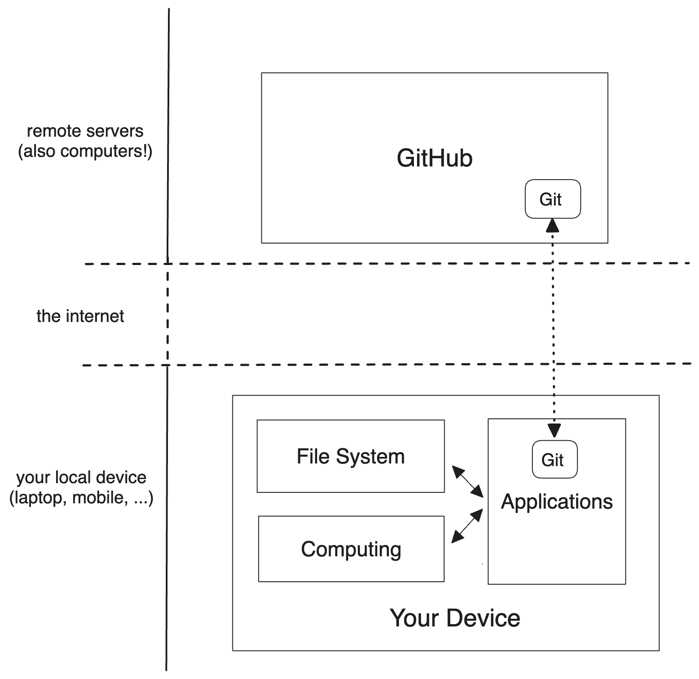
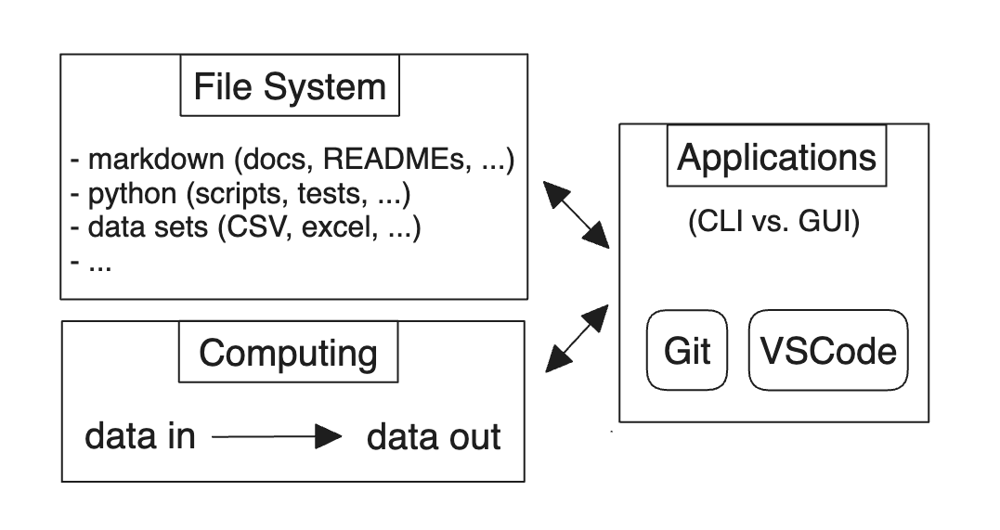
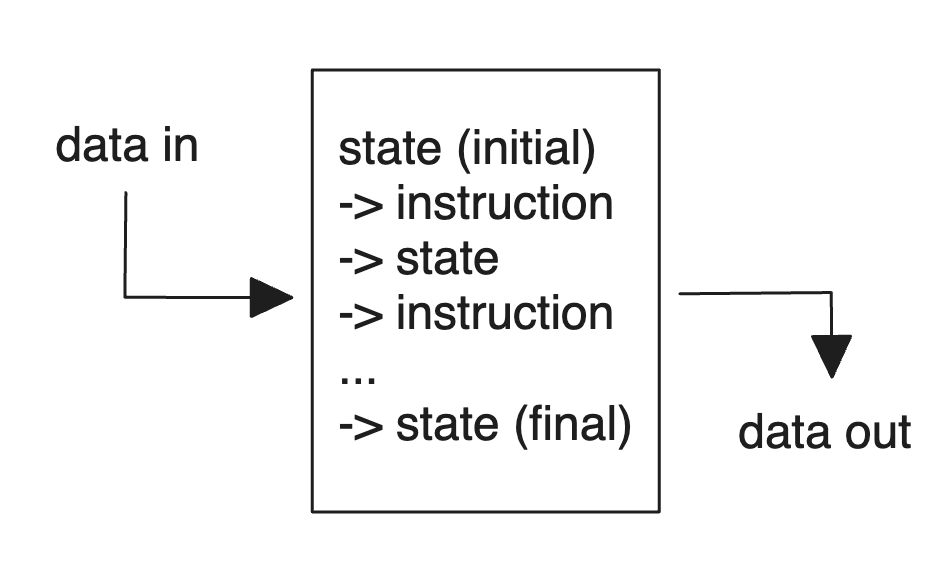
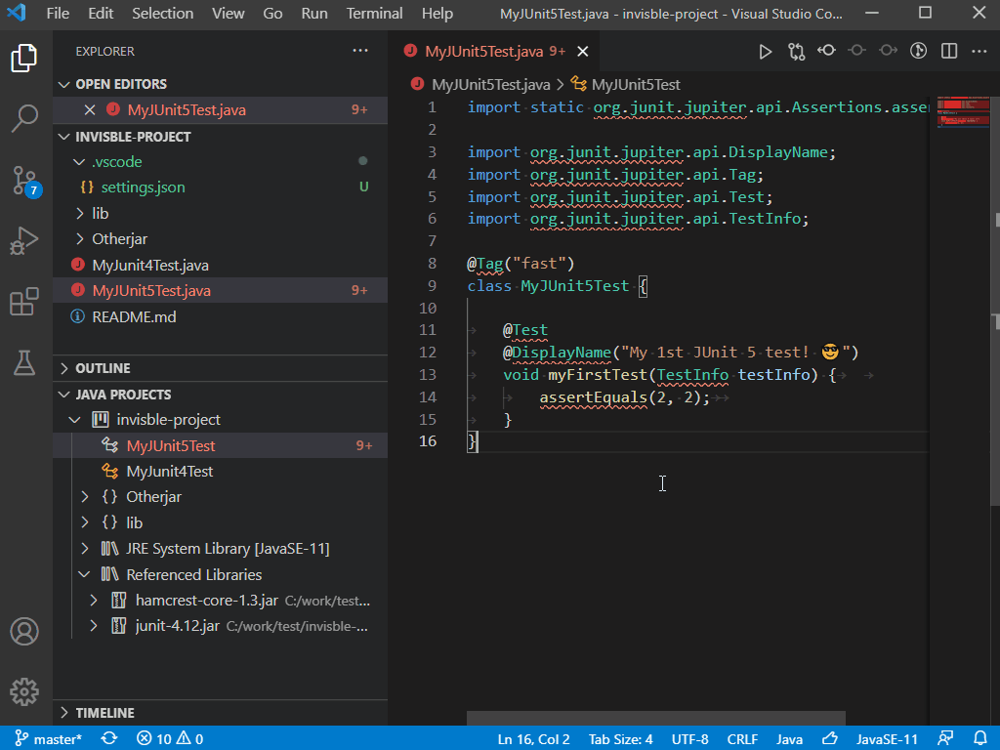
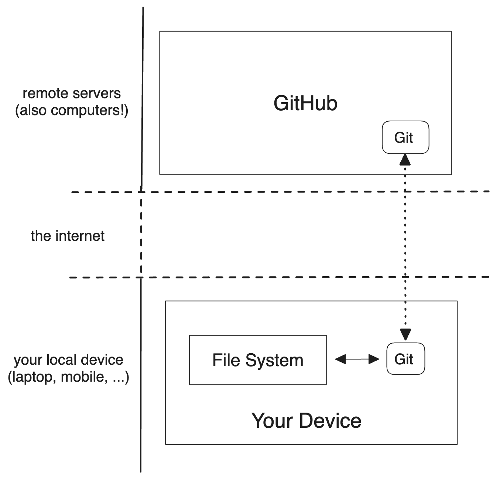
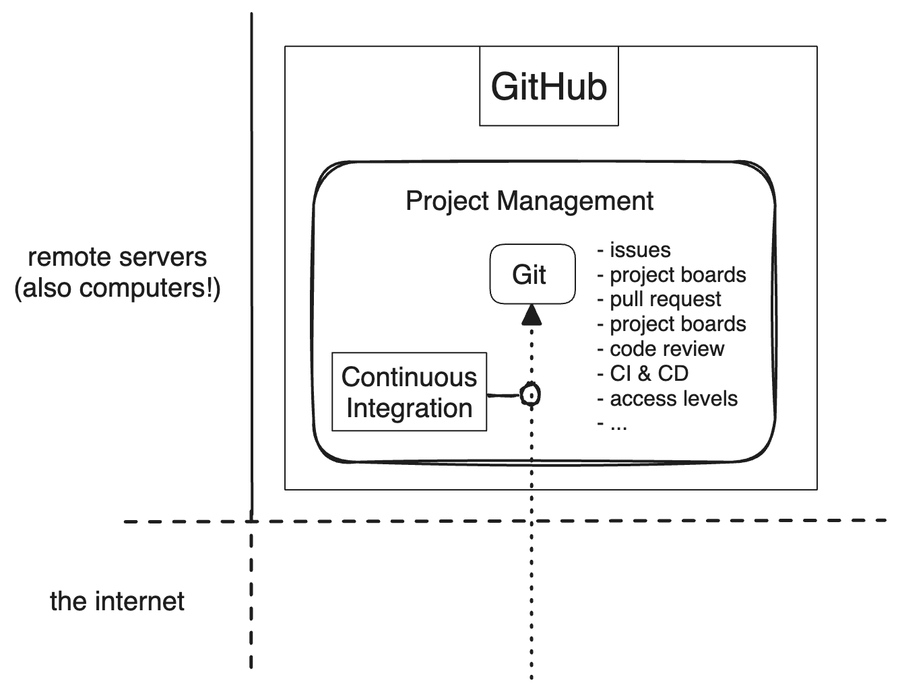

class: middle, center

<!-- this file is written for remark: https://github.com/gnab/remark/wiki -->

# Development Workflows

<br />


---

class: middle, center

## Pre-Knowledge: _Open Answers_

---

class: middle

## Agenda

- **Slack and Zoom Etiquette**

- **Pre-Knowledge Discussion**

- **Learning Objectives**

- **Connecting the Pieces**

- **Breakouts + Quiz**

- **Quiz Discussion**

Break!

- **Workflows Demo**

- **Breakouts + Quiz**

- **Quiz Discussion**

- **Deliverables**

- **Q & A**

---

class: middle, center

## Slack and Zoom Etiquette

---

class: middle

## Learning Objectives

Just Enough Workflow:

- Basic idea of computers:  _applications, folder system, computing_

- Cloning a repository from GitHub.

- Writing and editing Python and Markdown.

- Formatting and linting Markdown.

- Using Git to version and host your code online.

- Passing Continuous Integration checks.

- _For this week: [objectives in the README](./README.md#learning-objectives)_

---

class: center

## The Big Picture



---

class: center

## Your Device



---

class: center

### Your Device: _File System_

```txt
/emerging_talent       <- folder
  /notes               <- folder
    command_line.md    <- file
    git.md             <- file
    python.txt
  /data_sets
    UK_health_expenses_23.csv
    UK_health_outcomes_23.csv
  /notebooks
    UK_healthcare_efficacy_23.ipynb
  README.md
  LICENSE
```


---

class: center

### Your Device: _Computing_




---

### Your Device: _Applications_

- help you connect _data_ and _computing_ to do something useful

- can access and modify your file system

- can use your computer's processing resources
  - _passes data input -> ... computing ... -> uses data output_

- help you understand what's happening inside your device


---

class: center

### Applications: _CLI vs. GUI_

<a href="https://vimawesome.com/plugin/emmet-vim" target="_blank"></a>
<a href="https://shipfoz.weebly.com/blog/visual-studio-code-java" target="_blank"></a>

---

class: center

### Applications: _Git_



???

Git helps you:

- save versions of your project you can return to
- create experiments without risking the main project
- combine experiments with the main project
- tag past versions of the project
- share this history remotely with other computers

---

class: center

## GitHub



---

class: middle, center

## Big Picture: _Quiz time_

### Breakout Groups

???

Breakouts will be longer than it takes to finish the quiz so you can get to know each other.

---

class: middle, center

## Big Picture Quiz

### _discussion_

---

class: middle, center

# Break

```py
import time

time.sleep(300)

print('back to class')
```

---

class: middle

## Workflows Demo

Writing and running Python (_data is also instructions!_):

- **From CLI**

- **From VSCode**

Writing and pushing Markdown:

- **Creating repo from template**

- **Cloning repo from CLI**

- **Editing Markdown in VSCode**
  - _Check linting suggestions!_

- **Pushing changes to GitHub**

- **Checking CI/CD**

---

class: middle, center

## Demo 1: _Writing & Running Python_

### Nano (_CLI_)

---

class: middle, center

## Demo 2: _Writing & Running Python_

### VSCode (_GUI_)

---

class: middle, center

## Demo 3: _Remote Development_

### Template -> Clone -> Write -> Push

---

class: middle, center

## Workflows: _Quiz time_

### Breakout Groups

???

Breakouts will be longer than it takes to finish the quiz so you can get to know each other.

---

class: middle, center

## Workflows Quiz

### _discussion_

---

class: middle, center

## Deliverables: _Profile README_

**Create [a GitHub profile README](https://docs.github.com/en/account-and-profile/setting-up-and-managing-your-github-profile/customizing-your-profile/managing-your-profile-readme) ...**

**using [this template repository](https://github.com/MIT-Emerging-Talent/username) ...**

**written in VSCode, [Codespaces](https://docs.github.com/en/codespaces/overview) or [VSCode.dev](http://vscode.dev/)...**

**passing all [Continuous Integration](https://github.com/resources/articles/devops/ci-cd) checks ([like this](https://github.com/MIT-Emerging-Talent/username/actions))...**

**... or, explain in a comment why you are ignoring the rule.**

**And, start on [Python Self-Study 1](../2__python_self_study_1/).**

---

class: middle, center

# Q & A

---

class: middle, center

# Thank You

<br />


---
