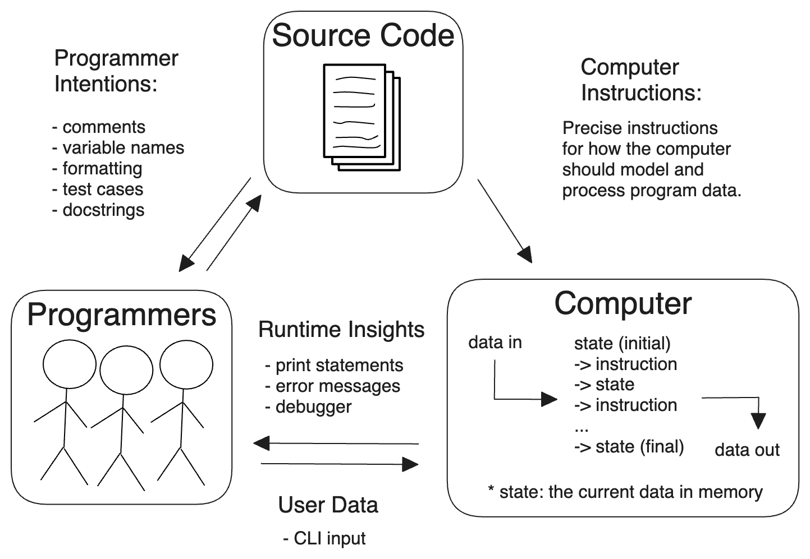

# Predictive Stepping

_Predictive Stepping_ is a study method where you quiz yourself on each step of
a program's execution, checking your predictions with using a debugger. After
you have a basic familiarity with your debugger, this study method is simple and
effective - it's like having a teacher by your side every day of the week!

- [Learning Objectives](#learning-objectives)
- [What is Programming?](#what-is-programming)
- [Program State](#program-state)
- [Studying the Examples and Exercises](#studying-the-examples-and-exercises)
- [Prep Work](./prep_work.md)
- [Lesson Plan](./lesson_plan.md)

---

## What is Programming?

Programming is communication. It's also a lot of other things, but this
introduction will focus on the different ways you communicate with your code.

When you write code you are really just writing a text document, exactly like
you might write an email or a note. The biggest difference between an email and
a computer program is _who you are writing for_.

When you write an email you're writing for the person who will be reading it.
When you write a computer program you are writing for 3 very different audiences
at the same time! One single document (your code) needs to be understandable to:

- **Developers**: A developer needs to read your code and understand what you
  were trying to do and why.
- **Computers**: Your code needs to have _perfect_ syntax so the computer can
  parse it, and you must write instructions that are allowed by the programming
  language or the computer will throw an error.
- **Users**: The instructions you give to the computer must create an intuitive
  and pleasant experience for the user.

Being a developer means understanding how all these characters interact, and
then communicating with everyone involved to deliver quality software within
your project's constraints. This diagram shows the different channels of
communication in a simple Python program:

> PS. In the examples and exercises for this chapter you will be both the
> developer and the user, running the program and interacting with it from
> command line.

## Program State

_Program State_ is a term that refers to the values stored in memory at EACH
SPECIFIC MOMENT of execution. These values can change often, sometimes at every
step of your program! Learning to program requires you to understand:

- how the Python environment represent memory
- how the Python environment interpret your code line-by-line
- how each instruction interacts with program memory

Your first goal is learning to see what is happening inside your program at each
step using the _VSCode Debugger_. It will take some practice to use effectively
and is worth every second. You can see every value in memory, at every step of
your program's execution. Debuggers are designed to help you understand how
memory is structured in Python.

## Studying the Examples and Exercises

This chapter has some examples that focus on single Python language features,
and some programs that combine language features into a program.

To carefully study a program, practice following these steps. You know you
understand a program when you can predict each step without mistakes:

0. Don't step forward yet!
1. Predict which line will execute next and how it will change program state
   (variables & callstack)
2. Step forward in the program.
3. Check your prediction.
4. Investigate if you were wrong: Is this a bug in the program, or is it
   something you did not understand?

> PS. You can write all the comments you want!

## Learning Objectives

Priorities: 🥚, 🐣, 🐥, 🐔 (click to learn more)

 

There is a lot to learn in this repository. If you can't master all the material
at once, that's expected! Anything you don't master now will always be waiting
for you to review when you need it. These 4 emoji's will help you prioritize
your study time and to measure your progress:

- 🥚: Understanding this material is required, it covers the base skills you'll
  need for this module and the next. You do not need to finish all of them but
  should feel comfortable that you could with enough time.
- 🐣: You have started all of these exercises and feel you could complete them
  all if you just had more time. It may not be easy for you but with effort you
  can make it through.
- 🐥: You have studied the examples and started some exercises if you had time.
  You should have a big-picture understanding of these concepts/skills, but may
  not be confident completing the exercises.
- 🐔: These concepts or skills are not necessary but are related to this module.
  If you are finished with 🥚, 🐣 and 🐥 you can use the 🐔 exercises to push
  yourself without getting distracted from the module's main objectives.

---

### VSCode Debugger

- 🥚 **Using Breakpoints**:
  - You can add and remove breakpoints, before and while you are debugging a
    program.
  - You can enable and disable breakpoints without removing them.
- 🥚 **Launching the Debugger**: You can open the debugger pane and launch a
  single-file Python program.
- **Debugger Buttons**
  - 🥚 **Skip Ahead**: You can skip ahead to the next breakpoint or the end of
    the program.
  - 🥚 **Step Over**: You can step _over_ a function call to ignore its
    implementation.
  - 🥚 **Step In**: You can step _into_ a function call to debug it's
    implementation.
  - 🥚 **Step Out**: You can step _out of_ a function call to resume debugging
    the main program.
  - 🥚 **Restart**: You can restart your debugger at the beginning of the
    program.
  - 🥚 **Exiting**: You can exit the debugger at any point of execution.
- 🥚 **Reading State**: At each point in a program's execution, you can find the
  value of any declared variable in the Variables pane.
- **The Call Stack**:
  - 🥚 You understand the relationship to between the _callstack_ pane, _local
    variables_ and _function calls_.
  - 🥚 You can view the local variables for each level of the callstack by
    clicking on it.
- 🐣 **Variable Categories**: You can explain the difference between _Locals_,
  _Globals_, _Function Variables_, _Class Variables_, and _Special Variables_
- 🐣 You can _predict_ a program's behavior while stepping through in the
  debugger:
  - Which line will execute next?
  - What will change in memory (_callstack_ and _variables_)?
- 🐣 You can identify steps of execution that surprise you. This will help
  understand the gap between what a program _does_ do, and what it _should_ do.
- 🐥 **Watch Expressions**: You can create helpful _watch expressions_ and use
  them to track information about your program that is not explicitly declared
  in the code.

### Other Visualization Tools

Other options besides the debugger in VSCode:

- 🥚 You can use a trace table to manually execute a program with pencil and
  paper.
- 🥚 You can use [Python Tutor](http://pythontutor.com/) to step through,
  visualize and predict program execution.
  - Python Tutor has a more approachable visualization than the VSCode Debugger,
    but can not handle large programs.
  - This does not replace VSCode as a code editor.
- 🐣 You can use the built-in Python `trace` module from CLI to help understand
  a script's execution:
  - `$ python -m trace -t path/to/file.py`: prints each line as it's executed to
    the console.
  - `$ python -m trace -c path/to/file.py`: generates a new `.cover` file
    indicating how many times each line of code was executed.
- 🐥 You can use the built-in python `pdb` module from CLI to step through a script in the interactive debugger:
  - `$ python -m pdb path/to/file.py`: starts the script in pdb
  - `(Pdb) step` steps to the next line
  - `(Pdb) ll` prints the code surrounding your current line
  - `(Pdb) pp <expression>` evaluates the expression and pretty-prints the result
  - `(Pdb) where` prints the current callstack
  - `(Pdb) help` prints the options available in the Python debugger
  - `(Pdb) quit` quits the debugger
    indicating how many times each line of code was executed.
- (_optional_) You can use [Thonny](https://thonny.org/) to write, step through,
  visualize and debug small Python programs.
