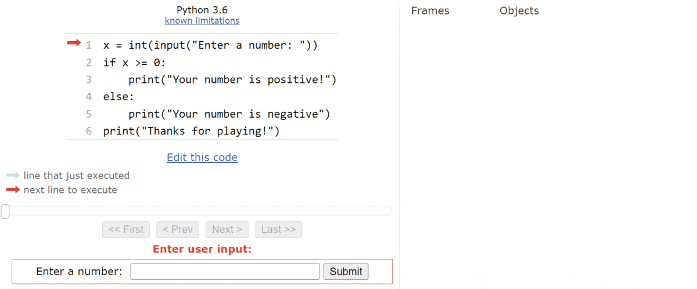

class: middle, center

<!-- this file is written for remark: https://github.com/gnab/remark/wiki -->

# Predictive Stepping

 

---

class: middle, center

## Knowledge Sharing: _Slido_

---

class: middle

## Agenda

- **Learning Objectives**

- **What is Programming?**

- **Visualizing Program Evaluation**

- **Predictive Stepping: _Demo_**

- **Breakout Groups 1: _./examples_**

- **Breakout Groups 2: _./exercises_**

- **Share Learnings + Discussion**

- **Q & A**

---

class: middle

## Learning Objectives

- **Programming is writing for 3 audiences**:  developers ,  users , computers

- **High-level comparison of different program visualization tools**

- **VSCode Debugger**: breakpoints, stepping in, skipping ahead, exiting

- **Predictive Stepping**: which instruction(s) will execute, what will change in state
  - _Your predictions don't need to be correct just yet!_

- For this week: _[objectives in the README](./README.md#learning-objectives)_

---

class: center

## What is Programming?

---

class: middle

## Visualizing Program Evaluation

- Slowing down program steps to human speed

- Inspecting _program state_

- Highlighting the current and/or next instructions

- _Stepping through_  and _skipping over_ instructions

- Different visualizations for different aspects & different levels

---

class: center, middle

### Visualizing Programs: _[Trace Tables](https://www.101computing.net/trace-table/)_

---

class: center, middle

### Visualizing Programs: _[Python Tutor](https://pythontutor.com/visualize.html#mode=edit)_

---

class: center, middle

### Visualizing Programs: _[Thonny IDE](https://thonny.org)_

---

class: middle

### Visualizing Programs: _[Futurecoder IDE](https://futurecoder.io/course/#ide)_

- Snoop
- Python Tutor
- Birdseye

---

class: center, middle

### Visualizing Programs: _[The `trace` Module](https://docs.python.org/3/library/trace.html)_

 _(live demo)_

`$ python -m trace -t path/to/file.py`

`$ python -m trace -c path/to/file.py`

???

`python -m trace -t 2_predictive_stepping/examples/08_while_loops.py`

`python -m trace -c 2_predictive_stepping/examples/08_while_loops.py`

---

class: center, middle

### Visualizing Programs: _[The `pdb` Module](https://docs.python.org/3/library/pdb.html)_

 _(live demo)_

- `$ python -m pdb path/to/file.py`

- `(Pdb) step` steps to the next line

- `(Pdb) pp <expression>` pretty prints the variable's value to the console

- `(Pdb) ll` prints the current code level

- `(Pdb) quit`

???

`python -m pdb 2_predictive_stepping/examples/08_while_loops.py`

---

class: center, middle

### Visualizing Programs: _[VSCode Debugger](https://code.visualstudio.com/docs/python/debugging)_

_(live demo)_

---

class: middle, center

## Predictive Stepping:  _demo_

Before stepping:

- Which line will execute next?
- What will happen?
- What will will change in memory?

After stepping:

- Were your predictions correct?
- if not, what did you not understand?

---

class: middle, center

## Breakout Groups 1

### _./examples_

---

class: middle, center

## Breakout Groups 2

### _./exercises_

---

class: middle, center

## Learnings + Discussion

---

class: middle, center

## Q & A

---

class: middle, center

# Thank You

 

---
