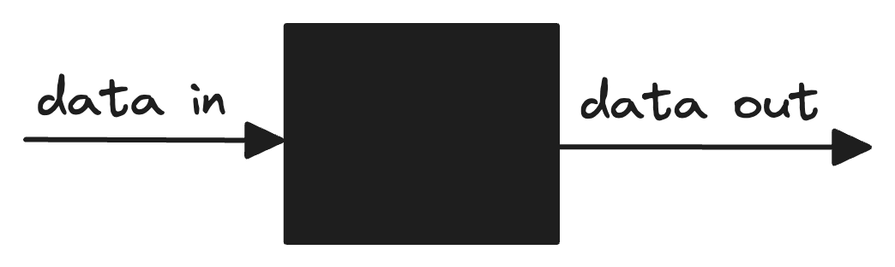
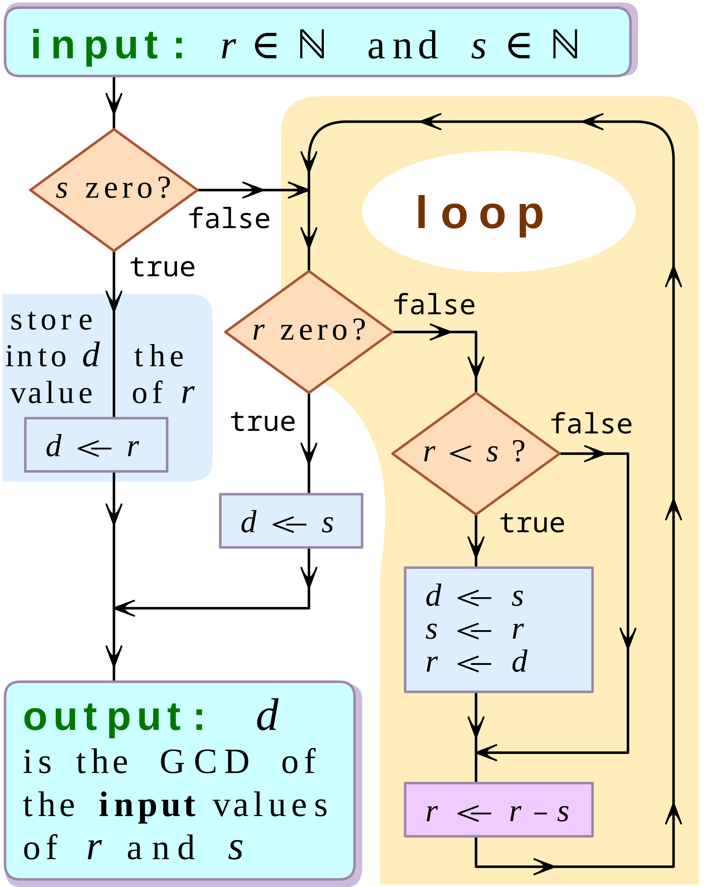

class: middle, center

<!-- this file is written for remark: https://github.com/gnab/remark/wiki -->

# Documenting and Testing

<br />


---

class: middle, center

## Knowledge Sharing: _Slido_

---

class: middle

## Agenda

- **Learning Objectives**

- **Behavior, Strategy, Implementation**

- **Code Review Checklist**

- **Breakout Groups 1: _BSI + review ./examples_**

- **Breakout Groups 2: _./exercises_**

- **Study Suggestion**

- **Share Learnings + Discussion**

- **Q & A**

---

class: middle

## Learning Objectives

- You begin to understand the difference between a function's:
  - **Behavior**: _data in -> data out_
  - **Strategy**: _algorithm_
  - **Implementation**: _Python code_

- You understand how a **code review checklist** can help you:
  - Study someone else's code
  - Write code that is easy for others to understand

- For this week: _[objectives in the README](./README.md#learning-objectives)_

---

class: middle

## [Behavior, Strategy, Implementation](./behavior_strategy_implementation.md)

- Naming things!

- Shared vocabulary for discussion

- Helps you learn more from less code

- Helps connect CS theory to applied programming

- Helps transition between different _levels of abstraction_

---

class: middle, center

## Behavior: _Black Box_



---

class: middle, center

## Behavior: _sorting_

### 4 2 3 7 → ■ →  2 3 4 7

### 4 -2 8 0 20 → ■ → -2 0 4 8 20

### 1 3 5 → ■ → 1 3 5

---

class: middle, center

## Behavior: _change naming style_

### snake_case → ■ → SnakeCase

### routine → ■ → Routine

### largest_in_list → ■ → LargestInList

---

class: middle

## Strategy: _Algorithms_

- There are many **strategies** for a single **behavior**

- _Abstract_ representation of problem-solving approach

- Avoids language-specific details (_side-effects, list methods..._)

- Quicker and simpler for discussion than writing code

- Support collaboration with non-technical stakeholders

- Can be closer to the mathematics and CS

---

class: middle, center

## Strategy: _flowchart_

<a href="https://en.wikipedia.org/wiki/Algorithm" target="_blanks"></a>

---

class: middle, center

## Strategy: _pseudocode_

```txt
fibonnaci_list(int) -> list of ints
    if int is zero
        return an empty list
    if int is one
        return [0]

    list = [0,1]
    while list is shorter than int
        add the last two numbers in the list
        append the sum to the end of the list

    return the list
```

---

class: middle, center

## Strategy: _formal notation_

```text
Let A = (a₁, ..., aₙ) be n comparable elements

bubbleSort(A) = Bₙ(A)
  
where Bᵢ(A) = {
    A                                   if i = 0
    Bᵢ₋₁(swap₁,ᵢ(A))                    if i > 0
}

where swap₍ₖ,ₗ₎(A) = {
    A                                   if k ≥ l
    swap₍ₖ₊₁,ₗ₎(s₍ₖ,ₖ₊₁₎(A))              if aₖ > aₖ₊₁
    swap₍ₖ₊₁,ₗ₎(A)                       otherwise
}

where s₍ᵢ,ⱼ₎(A) swaps elements aᵢ and aⱼ in sequence A
```

---

class: middle

## Implementation: _Working Code_

- There are many **implementations** for a single **strategy**

- Every implementation is a compromise: _readability, conventions, speed, ..._

- Simplicity and clarity should be top priorities

- Tools can help you write good code: _unit tests, formatters, linters, CI, ..._

---

class: middle

## Implementation: _Code Review_

- Standardize your team's _implementation_ standards

- Avoid avoidable mistakes

- Offload your attention to a checklist and automations

- More work in the short term, less work in the long term

---

class: middle

## Code Review: _demo_

- **Open the [code review checklist](./code_review_checklist.md) and work from top to bottom**

_Rely on code quality automations_

**Print the docstring**: `$ python -m pydoc path/to/file.py`

**Run the doctests**: `$ python -m doctest -v path/to/file.py`

**Run the unit tests**: `$ python -m unittest path/to/tests/test_file.py`

**Step through the tests in the debugger**:  

- open the function and tests side-by-side
- place a breakpoint in the first line of the function
- open the VSCode debugger pane
- start `ET: Debug Python (unittest)`

**Lint the code**:

- _with VSCode extensions_
- `$ ruff check ./path/to/file.py`
- `$ pylint ./path/to/file.py`

---

class: middle, center

## Breakout Groups 1

### _BSI + review the example_

---

class: middle, center

## Breakout Groups 2

### _./exercises_

---

class: middle, center

## Study Suggestion

### _Learn by forfeiting!_

---

class: middle, center

## Discussion, Q & A

---

class: middle, center

# Thank You

<br />


---
