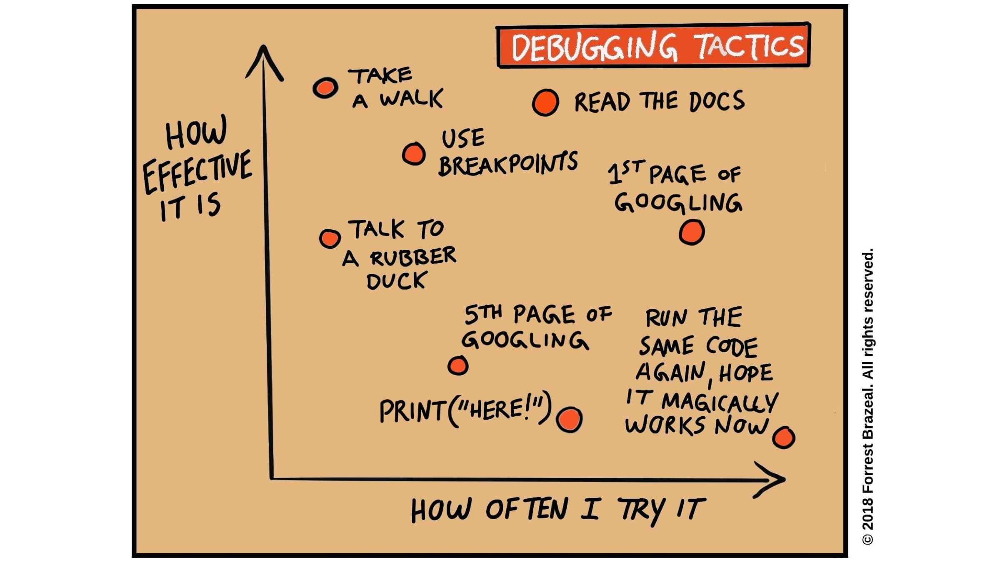

# Debugging

> Debugging is twice as hard as writing the code in the first place. Therefore,
> if you write the code as cleverly as possible, you are, by definition, not
> smart enough to debug it.
>
> - [Brian Kernighan](https://github.com/dwmkerr/hacker-laws#kernighans-law)

Debugging is a complicated skill. It's a mix of experience (_"I've seen this
before ..."_), strategies ("I'll try back-tracing this time"), specific
knowledge (_"This list method modifies the data in-place"_), patience (_"Breath
in, breath out, try again"_) and good habits (_"If only I'd written tests!"_).
You will never know everything about debugging because every project is
different. But if you practice good habits, can avoid many bugs and be ready to
fix the bugs you can't avoid.

- [Learning Objectives](#learning-objectives)
  - [Fixing Errors](#fixing-errors)
  - [Avoiding Bugs](#avoiding-bugs)
  - [Fixing Bugs](#fixing-bugs)
- [Errors vs. Bugs](#errors-vs-bugs)
- [Understand, Plan, Experiment](#understand-plan-experiment)
  - [Surprises](#surprises)
  - [Experiments](#experiments)
- [Philosophy of Debugging](./philosophy_of_debugging.md)
- [Prep Work](./prep_work.md)
- [Lesson Plan](./lesson_plan.md)

## Learning Objectives

Priorities: 🥚🐣🐥🐔 (click for more info)

 

Learning objective for this workshop are labeled so you can prioritize your
study time. The emojis show the _minimum_ mastery you are expected to achieve
for each skill, but there is no maximum! If you have the time you should aim to
master all of the skills introduced in this workshop.

- 🥚 You are expected to master these skills. They are the foundations you will
  need to move forward.
- 🐣 You are expected to be comfortable with these skills. It's ok if you still
  need help sometimes.
- 🐥 You are expected to be familiar with these skills. It's enough to recognize
  them in practice and apply them with help.
- 🐔 You are not expected to know these skills, but they are important if you
  want to excel. You should only focus on these after mastering the 🥚, 🐣 and
  🐥 objectives.

---

### Fixing Errors

- 🥚 Understand the difference between an _error_ and a _bug_.
  - **Error**: When the Python interpreter cannot execute your code and the program stops.
  - **Bug**: When your program runs, but it's _behavior_ is not what you expected or wanted.
- 🥚 Use error messages and your debugger to find where errors occur in your code.
- 🥚 Search errors online using the _name_, the _message_ and your code for context.
- 🐣 Understand the difference between _syntax_ and _semantic_ (or _runtime_) errors.
- 🐣 Understand and explain why your error occurred: what about your code caused the program to stop?
- 🐣 Fixing errors in your program.

### Avoiding Bugs

- 🥚 Pair programming with someone you trust.
- 🥚 Always use the simplest and most understandable solution.
  ([KISS](https://github.com/dwmkerr/hacker-laws#the-kiss-principle))
- 🥚 Develop your code one small step at a time, writing and running tests for
  each change before moving on.
- 🥚 Have others read and review your code, they will find mistakes you missed
  and think of improvements you wouldn't.
- 🥚 Write less code. Keep your end goal in mind and avoid writing any code that
  is not _absolutely necessary_ to reach your goal.
- 🥚 Keep a _Bug Log_; Write down bugs you've encountered and how you fixed them.
  This log will help you avoid making the same mistakes, and double as
  inspiration for how to fix new bugs.
- 🥚 Know that someone else will always use your [differently than you'd like](https://www.youtube.com/watch?v=CfCiW4UhqLo).
  - _test as many edge cases as possible!_
- 🥚 Don't trust AI without checking it's work!  Always take the time to understand, test and debug code AI writes for you.

### Fixing Bugs

- 🦆 You are not embarrassed to do some
  [rubber duck debugging](https://rubberduckdebugging.com/).
- 🥚 You can study a program skeptically, always asking "_how can I break this
  program?_".
- 🐣 You can identify steps of execution that surprise you. This will help
  understand the gap between what a program _does_ do, and what it _should_ do.
- 🐣 You can clearly describe a bug by answering questions like these:
  - on what line does the bug occur?
  - what values were stored in memory when when the bug occurred?
  - what language features are involved with the bug?
  - what _should_ the program do? Name specific test cases and lines of code!
  - What _does_ the program do? Name specific test cases and lines of code!
- 🐣 You can recognize these four types of bug: overt vs. covert, and persistent
  vs. intermittent.
- 🐥 You can trace a program backwards from a surprising step to understand how it happened
  - Either mentally or on paper, almost all debuggers only go forward.

---

## Errors vs. Bugs

Python mistakes (or _errors_) are when your program is not able to finish because you wrote code that Python cannot execute.
Logic mistakes (or _bugs_) are when your code runs without an error, but does
not do what you expected.  It will take practice to recognize the difference, [this video](https://www.youtube.com/watch?v=tV0tQisuxPo) has some funny examples to get you started -
You can think of errors vs. bugs in normal language:

- **Error**: A sentence can have incorrect grammar, so others can't understand it - _Chair train did doing water_.
- **bug**: A sentence can have correct grammar and still mean something different than you intended - _The panda eats shoots and leaves_.

While fixing errors "only" requires a solid understanding of Python syntax and
runtime. Fixing logic mistakes also requires an understanding of debugging strategies, testing and strategic thinking.

---

## Understand, Plan, Experiment

Fixing bugs requires carefully understanding what your code _does do_ before trying to
make it do what you _want_ it to do. After you understand the difference between
what it _does_ do and what it _should_ do, you can make small
experiments to discover how you can go from buggy code to working code.

Becoming a master debugger will take lots of experience, the more bugs you've
fixed the more solutions you know. Practicing this structured approach will help
you learn the most from each bug you encounter.

### What _does_ it do?

When you're already thinking of what the program _should_ do, it's too easy to
look at your buggy code and see what you _want_ to see. Not what's actually
there. Clearing your mind and telling yourself "I know nothing" is the first
step to understanding _exactly_ what the buggy code does and how it works.

Here some questions you should practice asking and answering when debugging. If you can't answer these questions then fixing your bug will be luck, not skill!

1. **What _should_ the code do?**  The best way to understand what a function _should_ do is to write documentation and unit tests covering as many _edge cases_ as possible.
2. **What _does_ it do?**  Run your unit tests and study the output to understand the buggy function's _behavior_.  Can you see a pattern in which tests pass and which ones fail?  When a test fails what did the function _actually_ return, and how does this compare to the _expected_ value?
    - You might want to write _documentation_ for your buggy function before you start debugging it!  This will force you to understand it's _behavior_ very well before moving on.
3. **How _does_ it work?**  Spend the time to really understand the function's  _strategy_ and _implementation_ before you start making any changes:  Read the code, add comments for yourself, step through the function using paper or a debugger, ...

### Surprises

The whole point of debugging is that you _expect_ your code to do one thing, but
it _actually_ does something different. That means there must be at least one
line of code that surprises you! Finding the line(s) or step(s) that that surprise you is a huge step towards fixing your
bug. If there is a line of code that surprises,
then there's a good chance it has something to do with your bug.

As you study the function, mark any lines of code or steps of execution that surprise you.  Careful!  You're not trying to fix the bug yet, you're still trying to understand the function _before_ you make any changes. Take notes on:

- What values were stored in memory when the code surprised you?
- What actually happened that surprised you?
- What did you expect to happen instead?
- ... anything else that jumps out at you. You never know which details might be important!

### Experiments

After you've understood what the code _should_ do, what the code _does_ do and
you've found the lines that surprise you - it's time to start experimenting!
This is where the real debugging begins.

Fixing a bug doesn't happen by magic, and it usually doesn't happen in a
single moment of genius. Fixing a bug happens in small steps using trial and
error. You can think of it as a conversation with your code.

- You ask your code if you found the answer by making a small change and running the tests.
- The tests tells you if you found the answer by either passing or failing.

There are may

- Is something is missing?  Try adding it in.
- Is there something extra that shouldn't be there?  Try removing it.
- Is something int he wrong place? Try moving it somewhere else in the function.
- Is it in the right place, but the logic isn't correct?  Try making small changes to the logic and running the tests after each change.

By taking notes on all the little experiments you make and what happened you can
carefully fix your bugs without causing more problems. (and learn a lot on the
way)

---
---

