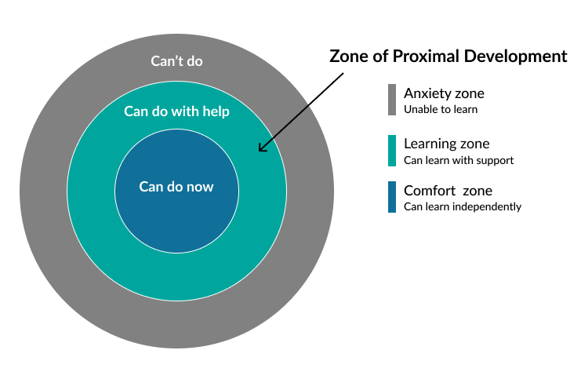

class: middle, center

<!-- this file is written for remark: https://github.com/gnab/remark/wiki -->

# Debugging

 

---

class: middle, center

## Knowledge Sharing: _Slido_

---

class: middle

## Agenda

- **Learning Objectives**

- **Zone of Proximal Development (_ZPD_)**

- **Errors vs. Bugs**

- **Avoiding Bugs**

- **Fixing Bugs**

- **Breakout Groups: _./exercises_**

- **Discussion + Q&A**

---

class: middle

## Learning Objectives

- You can use the ZPD model to choose which challenges to study

- You can describe the difference between an _error_ and a _bug_

- Remember: It's easier to avoid bugs than to fix them!

- Good habits are the key to avoiding and fixing bugs

- Buggy code isn't "broken", it behaves differently than you _expected_

  - Take time to understand the code before making changes

- You understand the value of careful habits when debugging:

  - Write good tests and run them frequently

  - Make one small change at a time, then run and study the tests

  - Keep a Bug Log!

- For self-study: _[objectives in the README](./README.md#learning-objectives)_

---

class: middle, center

## Zone of Proximal Development (_ZPD_)

---

class: middle

## ZPD: _study advice_

- You have of two separate ZPDs as you learn to program
  - The **difficulty of challenges** you study
  - The **debugging process** you use to study challenges

- Focus on your **debugging process**, not hard challenges
  - Repeat the _entire process_ with _good practices_ on easy challenges
  - Not fewer times with harder challenges with bad practices

- Focus on coding challenges in your _can do now_ zone

---

class: middle

## Errors vs. Bugs

- **Errors**:  When your program stops running because of a Python mistake

- **Bugs**: When your program runs, but does something unexpected

---

class: middle

## Avoiding Bugs: _good habits_

- Pair Programming

- Have someone else proofread your code whenever possible

- Keep a _Bug Log_ and reference it when you write code

- Write lots of tests and run them after every small change

- Try writing tests _before_ writing code!

  - _we'll see this in the next workshops_

---

class: middle

## Avoiding Bugs: _KISS*_

Debugging is twice as hard as writing the code in the first place. Therefore,
if you write the code as cleverly as possible, you are, by definition, not
smart enough to debug it.

[Brian Kernighan](https://github.com/dwmkerr/hacker-laws#kernighans-law)

 
 
 

> \* Keep it simple, stupid.

---

class: middle

## Fixing Bugs

- Be very clear what the code _should_ do

  - Documentation
  - Unit Tests

- Take your time understanding what the code _does_ do

  - Studying test output
  - Predictive stepping

- Find the line(s) or step(s) that surprise you

- Make one simple, experimental change at a time

  - What do you expect should happen now?
  - Run the tests and study the output
  - What actually happened?

---

class: middle, center

### Fixing Bugs: _Rubber Ducky_

---

class: middle, center

## Breakout Groups

### _./exercises_

---

class: middle, center

## Discussion + Q & A

---

class: middle, center

# Thank You

 

---
