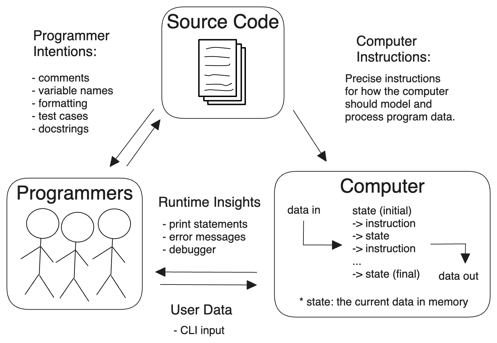

class: middle, center

<!-- this file is written for remark: https://github.com/gnab/remark/wiki -->

# Code Review

 

---

class: middle, center

## Synchronous Introductions

---

class: middle

## Agenda

- **Learning Objectives**

- **Challenges in Collaborative Programming**

- **Code Review: _the golden rule_**

- **Group Exercise: _Code Review Tools_**

- **Setting Group Norms**

- **Group Exercise: _Group Norms Guide_**

- **The Repository: _a walk-through_**

- **Next Steps: _many smaller or fewer larger groups?_**

- **Next Steps: _group norms, review workflows, repo setup_**

- **Discussion + Q&A**

---

class: middle

## Learning Objectives

- **Review the code, not the person!**

- You can explain some key challenges of collaborative coding

- You understand the value of group norms and are ready to set your own

- You understand the project's goals and evaluation

- You are excited to begin studying collaborative development with your groups

- You have seen all the folders and files in the project repository

- **Not** GitHub Code Review tools, this is left for peer study and review sessions.

- For self-study: _[objectives in the README](./README.md#learning-objectives)_

---

class: middle, center

## Collaborative Programming is Collaborative Writing

---

class: middle, center

## Collaborative Writing

---

class: middle, center

## Collaborative Programming

---

class: middle

## Challenges in Collaborative Writing

- **Shared Understanding** - A _shared_ understanding of the _project goals_.

- **Consistent Communication** - Clear communication _channels_ and _conventions_.

- **Task Division** - Defining tasks that can be _completed separately_ and _reassembled_.

- **Task Tracking** - Reliably tracking _ownership_ and _progress_ of all tasks.

- **Proofreading** - _Reviewing_ each other’s work and providing _constructive feedback_.

- **Reassembling** - _Merging_ separate tasks into one _coherent_ finished product.

- **Merge Conflicts** - _Resolving conflicts_ when two people have _edited the same lines_.

- **Backtracking** - Returning to a _previous version_ of the project _when necessary_

---

class: middle, center

## Code Review: _the golden rule_

 
 

# Review the code, not the person

---

class: middle, center

## Collaborative Writing: _Group Exercise_

 
 

### _[The Tools of Collaborative Development](https://docs.google.com/document/d/15LZsLTD7U1DOMKtTcS0MO9-JzQov3KUL_KD8OIex4bI/edit?usp=sharing)_

---

class: middle, center

# Setting Group Norms

---

class: middle

## What are Group Norms?

- A list of guidelines for your group’s collaboration.

- An expression of your group’s beliefs and character.

- Expressions of intent, not of specific behavior.

- A living document - they should evolve with your group.

---

class: middle

## Why are Group Norms important?

- Writing them is a solid team building exercise.

- They encourage explicit communication about expectations.

- They can serve as a point of stability when disagreements arise.

- They can help onboard new members to your group.

---

class: middle, center

## Zone of Proximal Development (_ZPD_)

### _Let the ZPD guide your norms!_

---

class: middle

## ZPD: _norms that support learning_

- You have of two separate ZPDs as you learn to program
  - The **difficulty of challenges** you solve
  - The **development process** you use to solve challenges

- Focus on your  **development process**, not hard challenges
  - Repeat the _entire process_ with _good practices_ and easy challenges
  - Not fewer times with harder challenges with bad practices

- Focus on coding challenges in your _can do now_ zone

---

class: middle, center

## Defining Norms: _Group Exercise_

 
 

### _[Defining Group Norms Guide](https://docs.google.com/document/d/1RaPP8CWzTwvniiuXpTnnnSohWCHx5M4mm-ST24aPYBk/edit?usp=sharing)_

---

class: middle, center

## The Repository: _a walk-through_

### [`ET6-practice-code-review`](https://github.com/MIT-Emerging-Talent/ET6-practice-code-review)

---

class: middle

## Next Steps: _small or large groups?_

_Time for a vote!  Give a 👍 to your preference in the Chat_

- ## 🐘 -> fewer larger groups

- ## 🐁  -> more smaller groups

---

class: middle

## Next Steps: _norms, workflows, repo_

- We will create a public channel for each group on Slack

- We will share the group exercise docs: **workflows study** & **group norms**

- You will have a couple days to complete these exercises

- We will add you as collaborators in your group repositories

- You will set up your repositories according to the `/collaboration/guide`

- Let the coding begin!

---

class: middle, center

## Discussion + Q & A

---

class: middle, center

# Thank You

 

---
