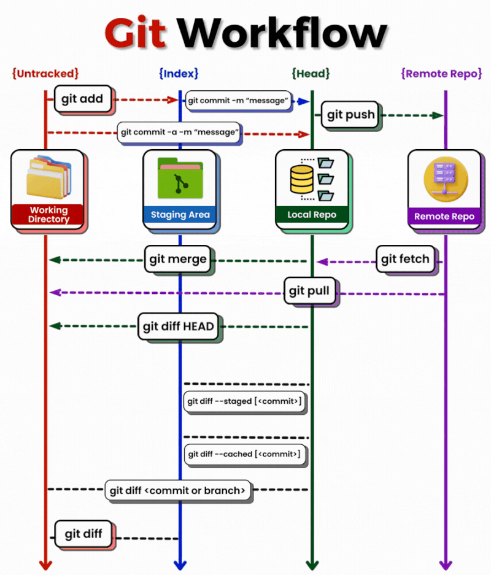

# Git and GitHub

The more time you spend studying Git and GitHub before the classes starts, the
easier it will be to focus on the fun stuff.

An overview and a big picture of Git and GitHub workflow.

 

<!-- https://github.com/talmurshidi -->

[Abstract Workflow Flowchart Source](https://viewer.diagrams.net/?tags=%7B%7D&highlight=0000ff&edit=_blank&layers=1&nav=1&title=HYF%20abstract%20workflow%20v1.0.drawio#R5VtZV9s6EP41Oad9CMd7yCNJgKQXKA20tH2TbcV2sS1XlknSX1%2FJlhfFzkY2LuVwSDTa7Jn5Po1GoqX2g9k1BpF7i2zotxTJnrXUQUtRlI5q0A8mmWcSWdb1TOJgz%2BayUvDg%2FYFcKHFp4tkwFhoShHziRaLQQmEILSLIAMZoKjabIF%2BcNQIOrAkeLODXpU%2BeTdxMeq50SvkQeo6bzywb3awmAHlj%2FiaxC2w0rYjUy5baxwiR7Bsyf7EXUCQfmFSLabus50VCXIQzySMIIGaym9uv44fhaDDK2gx%2FXLXHMEJZK5cQpp%2BLlnJFfx2PuIl5ZqGAFobAev6BEnyVkATDHvQdLwnKMZ6gGXsENg3j0p5z2nOS9jwzYSpmHW88C4Yx73Q7esyl4TO0R2HTWNPp9MxP672QP5gX0j8E%2BEGC3dizvWL0z9gBofcHEA%2FxscR3oE2K17gasOIdU0TaN%2Fexp9H8yb95Nq4%2FfYl%2Fg6%2B9%2Fx7vvrVLKwSzPvR9NmNapF%2B4NYTa1aMVnoJhSNbNms9UG3puvxgjU3aV259PFyMtMj8N73kX6QX4Caw6RkzmuZ9ilIQ2ZIPILbU3dakNHyJgsdophSaVuSTweXVMMHqGfeSnXhWikDbrTTzfXxDxaSEmcLYAhzUvKVdUew1RAAme0358lLacw5vTgsqL0xJinVzmVuBlnHMh4LB2irGVqvW4WptV3Hsh3wa68VMew6H38Kg%2BjId%2FcusJKjZ8Om3PpF8ckmojE0xQSATlG78TlFe045TCqJtLshHNsm68fslAFld6taE6SX%2FqfccwQBSe%2BbPhUh4hClzEVLFY9%2BHaI8PE%2FJjXUAVlU4uPU3ZY05CKK0rZxRGrPkdfWpK6XW1Qc1Bac66YqmEU823mfw2uu9wlO7Lgked1j5S1Bo88mEMqSx1yO7fZg58Wxr5BdGGkPVY6GyNm2qaPgighEH9c6V41cNVcbq%2FuJUn9%2FhGdSNe7J%2FYiuVPTILRpgMOLCNPIwkEh8C9Laa%2FUsURLZZsbhCKu2V%2BQkDmP1kBCkKh3qlY8%2F876n%2Bl58QcfLi0MZkJpzksZ7PM4S9naUjF1PYu%2F5uzz99vQuJ%2FfdxPTSD7dSr97X%2FKFlADsQLJCbVrWjqlqpd0x9GlY8iLGins3orqOCtZDXFsC8QCwsGtb6Enbhhh1bn%2B9kTeHoyxpazldakCjdjA0nq%2BKMhrMaCJsQ9zmVH%2BRdsUf2u2q%2FGNG8xtbHFLfpw2SyAaEWpPtVJgPSD4jd19g9J2eaHFiDGPkv8BsrzbxPYvEB5srAnHshQ6by4XWc9y84pySGAVaLFnyCMS4ivDWEqO%2BITHmC6J0JhU74jzW58WNuZOPfo%2B8lOzyJmgyiemzLmKyeIjXw1R7H3zLg53T8a3ebQh%2Fjkq43QZLHh%2F1B0evviF6z99UWKMfDmb0EwQMIXx5AaHlFrJX7jf%2BJyDUNDG10ghC%2BZggNFYFPXtOrYzuHi%2FHd5ePu2QwYGhfsMxxq8iD2SB2iz1nxd6ic%2Bxq47WwrFhQbzBgLnvtwsodqCP6T21vmrER71TNZC6Mo3fXDJTRVW2gfa3iclNK7x2S%2F%2FmG5J9j%2Fo2w%2F%2FKt0M7sD2z736F3%2BdT0Li9PTzRvajc1Y4gOsleUTGA9O6nhq82xY36g2mwpVAtS9UvzDjN%2FnDgCYfMD7WOWFfvYbOJtlrXDc92vJIjyKfjSWZx6HmUbK2%2Ba4JOVN0WGctMJ357Y0EJB4JF%2FhhA19eSEqJ0Ce8ty7kXdqVJLOdTWY3LT5NKOAa7W1QWPUaUjB6bK4cAeJbG7xXnuewO%2FqjSk%2BI8L%2FuW73X1kNcRt8%2F24buvlUdM2qfHN%2FOWYtFYU3kjGXN406aZuyGrcpaUzSe2o4pK248b%2B8Blz%2BZ%2FI5R39AFPTxJXqmAeYjefnTSvX2wl1jnm9YBXUq5Sw6hrCoQMdWRfPY2Tllam8xYGKnPL%2BI6ZGfR3wAkRtTY2S9HmqB3Xl4hmgmKR2sSC%2Fg2XDXRfQm%2By6b9XBge857KormwVS%2BukxyvAs4F%2FwisCz7QxLkL4jMNPxmItHzASpUfReSx80uvhKZNfvevKb1XySVvXy8pIjX73bEXkrB9Cu%2FiyuiorYfy%2Br2yq4HiZeZ9O%2F0%2Bh88Ty4MTrf0%2FpFi%2BVV%2Bszw5X8kqJd%2FAQ%3D%3D)

Git & GitHub workflows gif (click here)

 

Detailed workflow flowchart image (click here)

 

<!-- https://github.com/talmurshidi -->

[Detailed workflow flowchart source](https://viewer.diagrams.net/?tags=%7B%7D&highlight=0000ff&edit=_blank&layers=1&nav=1&title=HYF%20Workflow%20Steps%20v1.0.drawio#R7V1rd%2BI2E%2F41nNN%2BgOO74WNCNhvaJJtN0jeb%2FdJjQIAbX1jbbJL%2B%2BleyLWxL8g3kC9n2tA0IWbaleZ4ZzYykgTy13z57xnZz4y6BNZCE5dtAvhhIkiwIAvyDSt6jEmkylqOStWcuozIxKXgw%2FwVxYXzhemcugZ%2BpGLiuFZjbbOHCdRywCDJlhue5r9lqK9fK3nVrrAFV8LAwLLr0yVwGm6h0LOlJ%2BRUw1xt8Z1GbRL%2FMjcXL2nN3Tnw%2Fx3VA9Itt4Gbid%2FQ3xtJ9TRXJnwby1HPdIPrkzv9BryYJljGH%2FRvWi6482wUb14tKHg0beKjs%2Buav%2B4er2cUsqvPFWxuO%2Ba8RmK4T1byCj%2Fbs7rzLXbDz4EMJ58Bamzt7IF1eoK%2B3YOtG116bC%2BD4cVfczB5xqfMClrO4tU0QoLE4g1fDf19fX0dW%2BLvpjBYuatN04P8Cw7J33sY3l2ZYEbVz9Xw5fAJz3wwAq6kNfMx3%2BJir8DFHc5C58B49JOOqtRlsdvP41tk33b8magNL39Ps%2Fcm6ftE%2B%2F%2FHV%2F2H8df7n4%2B3%2Fhsko2G9TYFmo6fAr%2FBCPRubX4tb2MuQBJyi7K74T1fT47udyKOsz53E4v5jcXK7Xf9zElwg%2FDWsH0oLhB%2B9YgkMZBKgRYSCfv25gbz9sjQX69RWCFpZtAhtJlQg%2F%2BoHnvoCpa4VSFcqsfL4yLYsoim8LvAC8EUApeUkx1bWfgWuDwHuH1%2BFWtPiNYr4YjjGDvCboE2Vca5OGnjqJS40Y8%2Bt981J6AOOeZfeyqj2eP%2BvBt2vPfJ89bsBu%2BPA8lMp7GSwhbcRfXQ%2Bicu06hvUpKT3PjkNS59p1t3Hv%2FwOC4D3mQGMXuNmxqdPB8Nmg2C9AwUvFnRUY3hoEBfXi9tALpkaaHkEPWJBjfmZ5k%2FtQ0AL%2F8Hh2%2F0iNRyTImLIlQso3xhbVs9%2FWSG2NVpb7utgYXjDyYXcEf4s5QKk3AhQ6cqVeVvSs1KsqQ%2BoFhtBrTYm82oWEgzcz%2BJb6%2FIyaGqnxt4u3uOXwyzv%2B4sDX%2FZb%2BkroKfU0uC7%2Fh6zijCdsmZWhSeoUmLKkJmi7AykSGimAMkC2iWQFSAK4ThDaWFRsb2o8dMk5gJ8qrlRBaeUmRtkZ%2FfdsI74%2FbgM8XNRP9vPXcuQVsSsoq6ac0rFGjWCyFpgCqiiRANQZAJQZAx00BVP8PoLUAqlQEqNYrgCoUQL9sgYPu5ByJT9P3dyAfny5q%2F7MZXO3mx2M0a1UO0LxwMlEuGtSoutA7wIoi1ZFtIBajT6yHPox0oQbSD0fs7Lskb%2Fx3YfFdB%2BDvH4s%2Fln%2F%2FGIrjqhaqwBuz8aV3rhkCC4ucOCakShEJaYmeNb6OEJj9g1SSIWaXyBQddCFTnJlZo4eZ%2BfJSr5hZo4bibLkMvVPofxtErRHFIsdERLFzD7PrMcT9aAZwGCX41MIF8BeeuQ09O2HBNXIQ%2BdHnG9MCPvoprnznuchx4ecQ%2Fimy%2FESYVGF5tUWWl2i5uHU%2FOvEjOUqN%2B3QaSi5DIva%2FhFZ79OiiRljxtTxJVaZmlT0dVRkmFr%2BhMNoLF5bA%2BKGO1jQaIdmyMBmp2WaiF6d0Dd2YRMKE0ViO4koawxXd1coHxyq3q%2FNvN9vh1ezt5XE6fHkSv18ba8ZklKDJBECYE9EPQz%2BUI8iygqht3yKmJDjzGVSmvRZnUQmsntOoKp5F1YRzL4EmybWBpioYnYdCi6sAF75%2FSoJn%2Ft4a8MKoirCwoEaGrVxSkudtXHu%2B86s66UtUryBMp02qXpUwhSVdGakirX1ZXsuJ3JT27cQePkRlHopn3pCVqurGnjku6ZDM1ApN3QzaeNrdazPA8I3cJoaNcBm2h%2B423HnWvjRztzYs7Ybhrssk3LXJSB7TcJfbdKlItHvslExt3liu6uLEyQt9wTI9ijPHD6LwgbO1%2BcI4bFAw8Q0%2BDEIVjLIyhLbq9JTGnQIyhcHnDATzjeXUmF1exrPVdp2hzMmReprYlmiP5cOrGSw2sacsVpfO3N8eiWvbCPOMbMMPUBpUDq6FuWc46O4NWAYbsHhxd%2BhjtWc5PY7RJgTHKBLD36brLRKMTM%2B5umCcUubITPXFhpijkBHKqWPSL%2BrQGSNbDlJBYIN06gEjwIkNDniluIDCJ0kREczxRcQMICoeOoYNyEnAsTjPk6328S%2BRaRASdlOm8c9KzmsO%2F91a%2FJwMjOxQLsHK2IVS1Qf6mFSkD7lfiYL4uTnRR8ZqiX0MR7BIylhoiEeKRS3DL6n03kT01p6xNEHSRpz42wXpSFnSEZlGR6ukQwf5umChPNYghj4W6ZPO3sLkUs5Caq9YCD83LxZC6cnoOZ1leKm9tUCQOD0Dw3%2FhNN2oTh%2B9JQpZHeHobHdM0UmaZnHcvYgaDgpJCiO9thWUxCCzMUqlAe6o6jvhb8GwA%2FIKme4v4mzFkmj8mecZ76lqW1TBz7%2BRSmZBisQSI6K%2BrAhF9eGH6Am4Rk2xj5JBkXPMXrdfUrQ2z%2BU0NHDX0Rq5NBwMy1yjxWoLKE8ASv454hRzYVhn8Q%2B2uVxGyAO%2B%2Ba8xj5PJ5fO4g2Hj6vlAvaABlJvQQstwIT8wVlLFKxrjpxmklwbmxMglkUj04JOMMhQ1QiqyLTQXUFf64dypa2e1mXNRndz65d1RaMMoTNLpHNGHjmKxAHOBt8YHzkpb8MWyycn4vTCR0TuD%2F61Mx%2FRjHxwxvU4ZwijFppotXDnz5gStYtLYkGSmVcyKCoqCki9cx6G%2FH4nsFYl9P8y8ubuqa02ResXdMl%2FX2oWbQjIB1am7RHj%2BuoOMH6A3nCLHGa0nPh5uNQK3ObPZVqP5Ci9C%2FzipvAem%2FtRlnkPm522aoZihyqmsah5h2u7BQZ4jLZ%2FxJAspUZlkm2g3CZ7dP%2FRsuOP1IzUdv5V9T52sBakup9zzaNoXJYmrmj7zYkezV7Bs2IIvZzrrVIVDbgVr5t5h5Xq2weEewPNcz%2F9vkhAxI5HNL6ojhq0hy4w5gkgtJeJnbmjdEl%2B92P6h0bh2kgoLlXEHziO2htb1Eg2ds%2BaNG2WyEsoP55hL822AY3Mx3%2Fyy0TmdXDA0ZkTxWbMZtanZDG74FO2qXHrZW1WHBPt500vVzEOlJXoRJTyTwM6wccv8wjenMd5xIOSXFVruP4jzk%2FzAWEcmEhxLo2ZukhG2mk1LQq23mpTUG94SBV1F8e0Kvhi9zY0GtG7Zqy1%2FRyvsxdxuhGEbMet1tuCC%2BTSlHrpyz5uS43l7CMB2zzC77TJKp%2Ba7lGKx88Lhq5hW2QcPYPcpugojjlAk0jV8b7KKG8dmmxbLe4%2F9HnzDE5GSXbi2HWpHG%2Fg%2B2jO6Zr4vvnxoU7o1afEX06yyWCnE0dR6An329WbtzX68vz0Hwe395O71%2BRtzE5L2SYUzQagyTRDMt%2Be%2BkdpxEzRWlPhwIN%2FtwpyByFxebAxnXRBKYsN4GzbRBDLFPiFT1rLAVPHcvbPIo0Y7ZvLShU57%2Fn5URm6bkRStaka%2BdshmP5PJcVbGO%2FOC5mwOrTfbvh1gjvLxePct1FdZQNWaAiqMBGHSeytYY1kyvKN%2FiX60gbcO9arrrCwTbTN5WpG16hmlbSldWdJYQThskGaCcM3tctrNOQA5hCTWIqRmdCxvlmKY5p2G4DTSRS5o2SYadpFrfI3%2BB9f6mSyQS9jpl43DaRIRYp0w4nCtLuHX%2BAZFPt1eVB3dRg6JqRuoq7X8uimpEGVtnBELnXXuUqsn0OB1mk3sB%2Fv05f7Py%2BsvT7DOw%2BOnu4eqAgN7MxgUpJDnH5hV3b5gyVRWo1ZZsaJS1jWUKcvwfawq8Zlz9XVajZg%2Fkc4Bx5Rh0YgMqVKa8u%2FJ3doz9XwGeQN9uA1S5PUr9Q5KvC2Qo0aylB5qaY34WJUcIri7P6ZtWD9znEpvTY%2BGt%2BtX1QpuRaVNb7%2FSp9lNmbsl%2FHYHPBO%2BO1IhDVEE%2B%2BCRyt6%2BpvOmccbqOGuvjCVCRvidxFLEhXwTeZKthSDhJOeGlAYnyCNBUieC0JXPfB9aHADQJ4agc13hn1l0MtSHpyPSOmHSkdoQHTFRlq%2FS5uTgH20CV8vSQP%2FQ194D2w0ALVroTF7fDFzUFeRvv0Xa7%2FfKQl2e%2BpG%2FEUTC0XmztLTopqz1tNxREjmW5rLG3tyB01pdibSXWfHwpjQk%2BxCug3iOFhwOkrof7msXzpvgFYXiho59hnWmrr3dQXX5e6GAUfAqdVkfJWCNpyxqvZMjvon12d34iO12j96Rj2ive0XYeiKOwtCETfkEmeLCSuFq31LnbEQz0uGZ9ca8TeijhoL2zv5F5n62sF93hHT4vsAPIuH2QxuX%2Fz7e292HOhdAFPT9Cr1CeEujhtLX2XZFPxLtepBnzjjllN1jLZ1yOtHljLRoAtEEvwBgUX%2FknRgg5KWIN7SXfzZXt2B73g%2FDGGOpgjUwbnUS0g03tH6sTyHuy11vnW3AXfjcKSDfxElCpMEOmaQtZNvsR%2Fgw4CV97EzwTloFbz%2F2%2BurJRtadHXbNVvaqJmXEZahK0n4RRt2DZknFARuTqcYaPiFdoknHTSUARUdyF509xOmQbnfpRtfsbKdNemnYZy6KAjmbyDl0e9wmxbAyiH4FiimCQPmEgvtW%2BWxa0MekwODhqX2StUzunE011TS9cFhfm%2BfnvnWrEkWPU3CZQer6CwV6tPqlEDvlerz%2BmltBxPss9mJ1QeH7p3DwZIaXzUJRDY%2BpoPbmDbemyCTkRvr4%2BMOw8%2BN3aX3ZmFaUKctnrNE6kRVLFmUpf1iPUooSK5p8OrPoHnjmMOLKNSl3j32O%2FhPIAx2UCWFTHa5KqaYaVqUi7eg7wFRn6Nu56y2BN4zt9bPwFt5vw2G6%2FHemBi5V5Yc0XW%2FiMEOJgneeu%2FaA7zczg%2BiYK0VZIPfTGUraeITdzG2sMWbDvXTlyYfbtbhuBuIBi0v7aZVVdZUmVpkoyMpxVtk%2BvkLaChUDLDSHi%2Fq4pKl2dzQu7OvaKUQ5qZJh%2BuIgN1XbfveBtRpksinNQzIae0GWMt7EN2FKbYSXyJUxpa5T3jd%2BZEkn9IQLr4g%2BbmSFVXO9rRK9rYuMvKmmVkGx%2B5l1OtbpuLZaylkvStEuVwZaW9Y71iA44RjvIlCb%2BCUydZlsiZ%2FtfnX%2B7WY7vJq9vTxOhy9P4vdrYz08bI3uYkFS%2BofxlnHcdaPeIvcWdtcoBA2%2FQxUTU2siC%2FIhplbd4xFFAYfM8aJXqfh8RIk4QIKoP8icj9jKZjSFY8Mp2Xbm7w2p6IBZxqISfBTtsoltP%2FItsaOTbRszJUhPjaoqrN08BJ2ZddeU1Safdiy%2B0xVwVfeDrU14WQ4SVfEQ7mPYCNhOPdraUOXDrA3GSaJq9plEmWipOVLkfBJ3vqsyZ9FBMx5MIVXHW89%2FE6KVfPhPb92c98BYIgxchke93IOfJngdtObt7K%2FakNWsR6fVnRfZuKGNiRPbebGW1ujahi7UPXUOTdvvCdYfPUIub6yvR1pQE3wXqh25sDsiRuDVPvDyFLlPnJAmc4vcx3Rz9CytrGYEvR9nKzCdAhJj1zvmCLSUoqaRC2ZlUqaqkhzpIoAkX%2B2QSV6uOTox57%2FleieUv68oWW07VDDjtbEWlylRdARiFj5OeOUxA7g1F8ibtNvmy5PhHHkPPDXLuYXhQyHYLyN%2FQTUNNK5JAgYS%2B1h3w9J%2FwCKI5laGs9fsG2ChRmw0jAEwbBuJPSV8%2Fdg7rjHtDdU1mRiuaSyPF3Od6X4TuBrSC796LhrshD5RGPHGXQJU4%2F8%3D)

---

## Git

- Learn to visualize what happens inside of Git with:
  - [learngitbranching](https://learngitbranching.js.org/) +
    [a Video Guide](https://www.youtube.com/watch?v=dG0ke9vILQM)
  - [git-school](https://git-school.github.io/visualizing-git/)
  - [ohmygit](https://ohmygit.org/) - a git game
- [Git and GitHub for Poets](https://www.youtube.com/playlist?list=PLRqwX-V7Uu6ZF9C0YMKuns9sLDzK6zoiV)
  (also talks about GitHub)
- [merge-a-matic](https://github.com/lpmi-13/merge-a-matic)
- [Git Katas](https://github.com/eficode-academy/git-katas)
- [git-it](https://github.com/jlord/git-it-electron/)
- [Understand how to use Atomic Commits](https://curiousprogrammer.io/blog/how-to-craft-your-changes-into-small-atomic-commits-using-git)
- [rebasic](https://github.com/lpmi-13/rebasic)
- [Pro Git](https://open.umn.edu/opentextbooks/textbooks/1360): great open textbook

## SSH Connection to GitHub

- [GitHub's documentation](https://docs.github.com/en/authentication/connecting-to-github-with-ssh)
- [A helpful guide video](https://www.youtube.com/watch?v=8X4u9sca3Io)
- [A long but thorough explanation (starting at step 2.3)](https://www.theodinproject.com/paths/foundations/courses/foundations/lessons/setting-up-git)

## GitHub

- [lab.github.com/githubtraining](https://lab.github.com/githubtraining/paths/)
  - [first day on github](https://lab.github.com/githubtraining/first-day-on-github)
  - [first week on github](https://lab.github.com/githubtraining/first-week-on-github)
  - [prepare to use github](https://lab.github.com/githubtraining/prepare-to-use-github)
- [Getting Started with GitHub](https://help.github.com/en/github/getting-started-with-github)
- [Creating a GitHub Repository](https://www.youtube.com/watch?v=WfhRyz3Wf4o)
- [Creating a local repo and push](https://www.youtube.com/watch?v=vbQ2bYHxxEA)
- [GitHub & VSCode](https://www.youtube.com/watch?v=ZDo0Qht5D6w)
- [the git & the hub](https://www.howtogeek.com/180167/htg-explains-what-is-github-and-what-do-geeks-use-it-for/)
- [The Net Ninja](https://www.youtube.com/watch?v=QV0kVNvkMxc&list=PL4cUxeGkcC9goXbgTDQ0n_4TBzOO0ocPR&index=8)
- [RogerDudler Git Guide](http://rogerdudler.github.com/git-guide)
- [GitHub CheatSheet](https://github.com/tiimgreen/github-cheat-sheet)
- [Mastering Issues](https://guides.github.com/features/issues/)
- [GitHub for Collaboration](https://mozilla.github.io/open-leadership-training-series/articles/github-for-collaboration/)
- [How to Update a Fork in Github](https://rick.cogley.info/post/update-your-forked-repository-directly-on-github/)

## GitHub & Collaboration

- [A guide and diagrams for ET](https://github.com/DeNepo/planning-and-collaborating/blob/main/11-development.md)
- [Adding collaborators to a repository](https://www.youtube.com/watch?v=p49LRx3hYI8)
- [about code reviews](https://help.github.com/en/github/collaborating-with-issues-and-pull-requests/about-pull-request-reviews)
- [requesting a code review](https://help.github.com/en/github/collaborating-with-issues-and-pull-requests/requesting-a-pull-request-review)
- [prevent pushing to `main`](https://stackoverflow.com/a/57685576)
- [Git Workflow for 2](https://github.com/hackyourfuturebelgium/git-workflow-workshop-for-two)
- [Pull Requests](https://www.youtube.com/watch?v=2M16faxEQsg)
- [Git & GitHub for Poets](https://www.youtube.com/watch?v=BCQHnlnPusY&list=PLRqwX-V7Uu6ZF9C0YMKuns9sLDzK6zoiV)
- The Net Ninja:
  [11](https://www.youtube.com/watch?v=MnUd31TvBoU&list=PL4cUxeGkcC9goXbgTDQ0n_4TBzOO0ocPR&index=11)
- linking PRs to Issues:
  [reference 1](https://help.github.com/en/github/managing-your-work-on-github/linking-a-pull-request-to-an-issue),
  [reference 2](https://help.github.com/articles/autolinked-references-and-urls/)
- [closing Issues using keywords](https://help.github.com/en/enterprise/2.16/user/github/managing-your-work-on-github/closing-issues-using-keywords)
